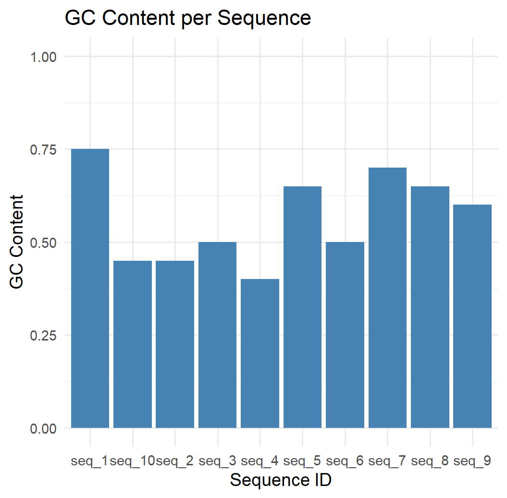

# Introduction

Package contains 3 functions:

-   [reverse complement computation,](https://www.bx.psu.edu/old/courses/bx-fall08/definitions.html)
-   [one-hot encoding and](https://www.geeksforgeeks.org/ml-one-hot-encoding/)
-   [GC content plotting.](https://en.wikipedia.org/wiki/GC-content)

## Package download

```{r setup, include=TRUE}
if (!require(ggplot2)) install.packages("ggplot2")
library(ggplot2)
```

## Data loading

```{r setup, include=TRUE}
load("example_sequences.RData")
head(example_sequences)
```

## Example data

```{r setup, include=TRUE}
data.frame(ID = names(example_sequences)[1:5],
           Sequence = unname(example_sequences[1:5]))
```

| seq_id | sequence             |
|--------|----------------------|
| seq_1  | GGGCGCCCGATCCACGTAGG |
| seq_2  | ATAAAGTCGCACGTCAGGAT |
| seq_3  | GTCAGAACGGTAGAGTCACA |
| seq_4  | ATTGACAAGACAGAGCTGTT |
| seq_5  | CCGTCCGGTACCACAAAAAA |

## Reverse complement and one-hot encoding

```{r setup, include=TRUE}
seq1 <- example_sequences[[1]]
rc <- reverse_complement_dna(seq1)
encoded <- one_hot_encode_dna(rc)
encoded
```

## GC content plot

```{r setup, include=TRUE}
plot_gc_content(example_sequences)
```


